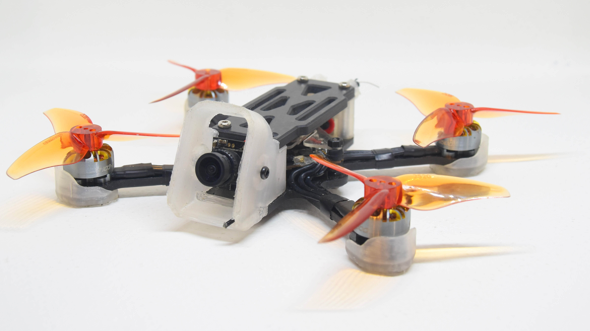

# Nav25 - Landing Page FPV Frame



Landing page profesional para promocionar el **Nav25**, un frame FPV 100% colombiano fabricado en fibra de carbono de 3mm, diseñado específicamente para freestyle y máxima durabilidad.

---

## 🚀 Características del Proyecto

### Diseño Moderno
- **Tema Cyberpunk Racing** con paleta de colores naranja neón (#FF5C00)
- **Efectos glassmorphism** y sombras con glow
- **Animaciones CSS** suaves y profesionales
- **Preloader animado** con CSS puro
- **Diseño responsive** optimizado para móvil, tablet y desktop

### Funcionalidades
- ✅ **Botón WhatsApp flotante** con animación de pulso
- ✅ **Sección FAQ interactiva** con accordion (8 preguntas frecuentes)
- ✅ **Galería de imágenes** del producto con 4 vistas diferentes
- ✅ **Especificaciones técnicas** completas y detalladas
- ✅ **Integración WhatsApp API** para contacto directo
- ✅ **Navegación suave** con smooth scroll
- ✅ **Menú hamburguesa** responsive para móviles

---

## 📋 Estructura de la Página

1. **Preloader** - Animación de carga con logo Nav25 y spinner CSS
2. **Hero Section** - Presentación principal con imagen del frame
3. **Especificaciones Técnicas** - Detalles completos del producto
4. **Galería Nav25** - 4 imágenes del frame (completo, cenital, patas, canopy)
5. **Características Premium** - 3 características principales:
   - 🇨🇴 100% Colombiano
   - 💎 Fibra 3mm
   - 🎯 Freestyle Ready
6. **Contacto** - WhatsApp, envíos y soporte
7. **FAQ** - Preguntas frecuentes con respuestas detalladas
8. **Footer** - Logo, redes sociales y copyright

---

## 🎨 Paleta de Colores

```css
--orange-neon: #FF5C00;      /* Color principal */
--orange-light: #FF8C42;     /* Naranja claro */
--orange-dark: #CC4A00;      /* Naranja oscuro */
--purple-dark: #1A0B2E;      /* Fondo oscuro */
--black-deep: #0A0A0A;       /* Negro profundo */
--carbon-gray: #1E1E1E;      /* Gris carbono */
--white: #FFFFFF;            /* Blanco */
```

---

## 🛠️ Tecnologías Utilizadas

- **HTML5** - Estructura semántica
- **CSS3** - Estilos avanzados con:
  - CSS Variables
  - Flexbox & Grid
  - Animations & Transitions
  - Glassmorphism effects
  - Media Queries (responsive)
- **JavaScript (Vanilla)** - Funcionalidades:
  - Preloader fade-out
  - Menú hamburguesa toggle
  - Header background on scroll
  - FAQ accordion
  - Smooth scrolling

---

## 📱 Especificaciones del Nav25

| Característica | Valor |
|---------------|-------|
| **Peso** | 22.6 gramos |
| **Material** | Fibra de carbono 3mm |
| **Hélices** | 2.5" - 3" pulgadas |
| **Voltaje** | 2S - 3S LiPo |
| **Stack Mounting** | 20x20mm / 25x25mm / 30x30mm |
| **Cámaras** | Analógico 19mm, DJI O3, DJI O4 |
| **Protección** | Patas impresas 3D |
| **Incluye** | Tornillería completa |
| **Origen** | 100% Fabricado en Colombia |

---

## 🚀 Instalación y Uso

### Requisitos Previos
- Navegador web moderno (Chrome, Firefox, Safari, Edge)
- Servidor local (opcional, para desarrollo)

### Instalación

1. **Clonar el repositorio**
```bash
git clone https://github.com/felipesolem/nav25-landing.git
cd nav25-landing
```

2. **Abrir el proyecto**
- Opción 1: Abrir `index.html` directamente en el navegador
- Opción 2: Usar un servidor local:
```bash
# Con Python
python -m http.server 8000

# Con Node.js (http-server)
npx http-server

# Con VS Code Live Server
# Click derecho en index.html > Open with Live Server
```

3. **Visitar en el navegador**
```
http://localhost:8000
```

---

## 📁 Estructura de Archivos

```
nav25-landing/
├── index.html          # Página principal
├── style.css           # Estilos CSS
├── app.js              # JavaScript funcional
├── README.md           # Documentación
└── img/                # Imágenes del proyecto
    ├── nav25-full.jpg      # Frame completo
    ├── nav25-top.jpg       # Vista cenital
    ├── nav25-legs.jpg      # Patas protectoras
    ├── nav25-canopy.jpg    # Canopy
    └── nav25-hero-bg.jpg   # Background hero
```

---

## 🎯 Optimizaciones Implementadas

### Performance
- ✅ Preloader CSS puro (eliminado GIF de 6.6MB)
- ✅ Imágenes optimizadas
- ✅ CSS minificado en producción
- ✅ Lazy loading de imágenes
- ✅ Animaciones con GPU acceleration

### SEO
- ✅ Meta tags optimizados
- ✅ Estructura semántica HTML5
- ✅ Alt text en todas las imágenes
- ✅ Títulos descriptivos
- ✅ URLs amigables

### UX/UI
- ✅ Diseño mobile-first
- ✅ Navegación intuitiva
- ✅ Botón WhatsApp siempre visible
- ✅ FAQ para reducir fricción
- ✅ CTAs claros y visibles

---

## 📞 Contacto

**WhatsApp:** +57 310 417 6563  
**Mensaje predefinido:** "Hola, estoy interesado en más información del Nav25"

---

## 🔄 Historial de Versiones

### v2.0.0 (Actual)
- ✅ Cambio de paleta a naranja neón (#FF5C00)
- ✅ Reorganización de secciones
- ✅ Botón WhatsApp flotante
- ✅ Sección FAQ interactiva
- ✅ Preloader CSS animado
- ✅ Eliminación de precio
- ✅ Actualización de navegación

### v1.0.0
- ✅ Diseño inicial Cyberpunk Racing
- ✅ Estructura base de secciones
- ✅ Integración WhatsApp API
- ✅ Galería de imágenes
- ✅ Especificaciones técnicas

---

## 📝 Licencia

Este proyecto es propiedad de **Nav25** - Frame FPV Hecho en Colombia.

Copyright © 2026 Nav25. Todos los derechos reservados.

---

## 🙏 Créditos

Desarrollado para promocionar el frame FPV Nav25, producto 100% colombiano diseñado para pilotos exigentes de freestyle.

**Hecho con ❤️ en Colombia 🇨🇴**
